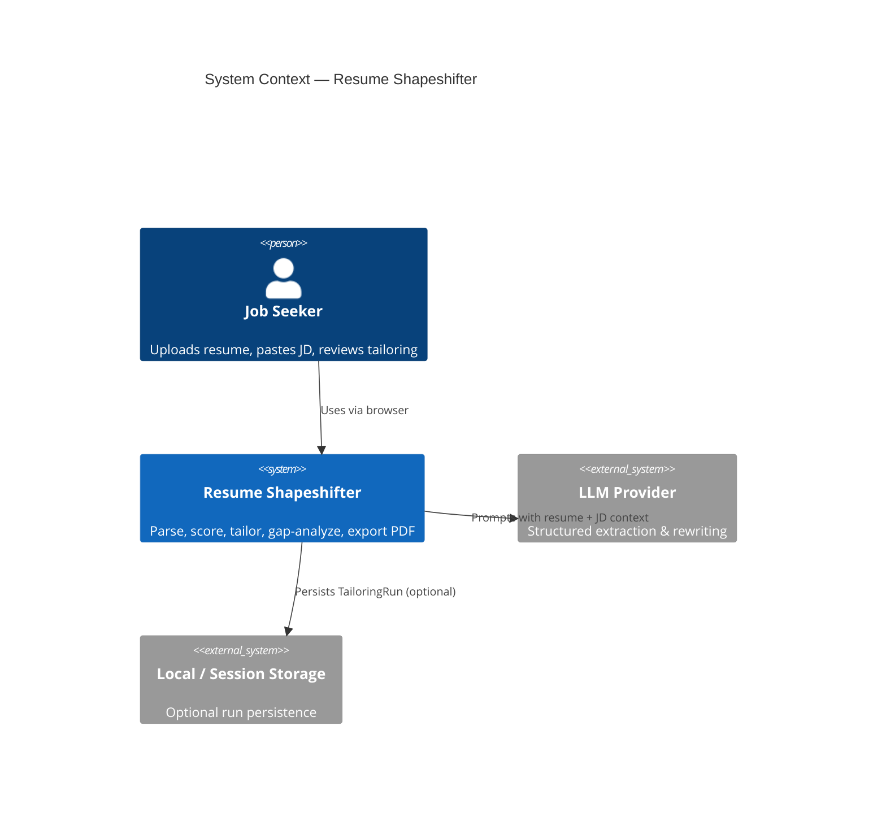
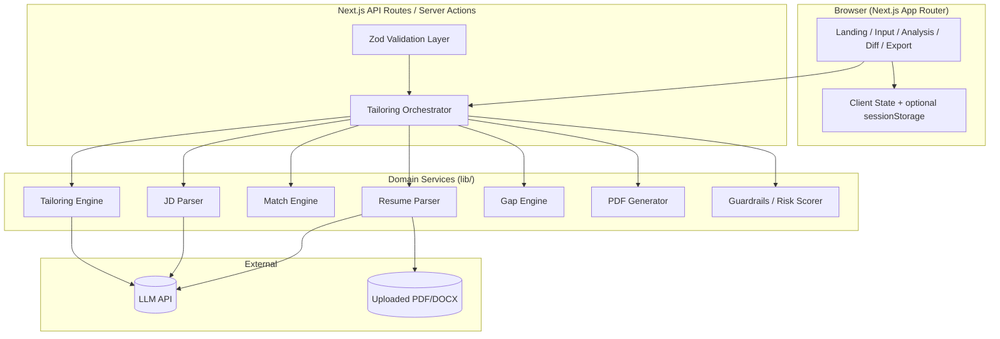
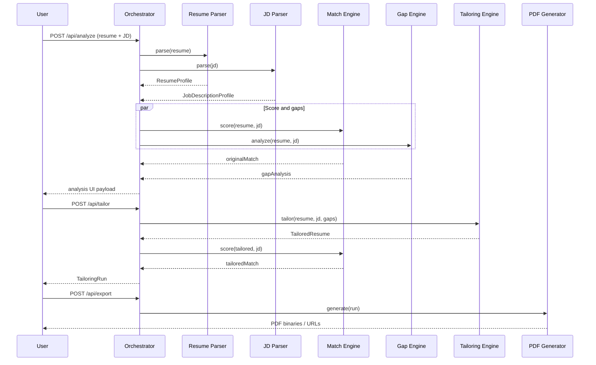
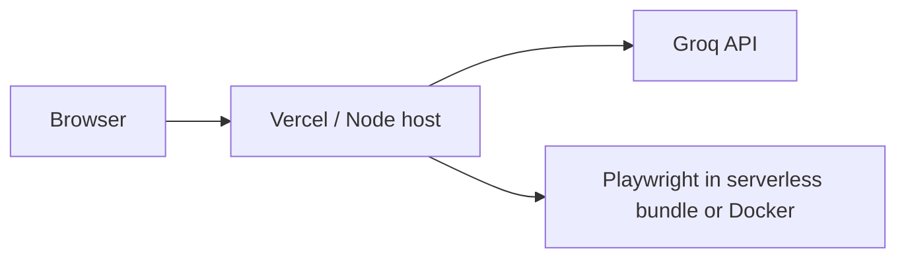

# Resume Shapeshifter — System Architecture

This document describes the technical architecture for **Resume Shapeshifter**, a JD-to-resume tailoring engine. It is derived from [problemStatement.md](./problemStatement.md) and is intended to guide implementation, reviews, and demos.

---

## Table of Contents

1. [Architecture Goals](#1-architecture-goals)
2. [System Context](#2-system-context)
3. [High-Level Architecture](#3-high-level-architecture)
4. [Technology Stack](#4-technology-stack)
5. [Application Layers](#5-application-layers)
6. [Core Domain Models](#6-core-domain-models)
7. [Service Design](#7-service-design)
8. [LLM Pipeline](#8-llm-pipeline)
9. [Truthfulness & Guardrails](#9-truthfulness--guardrails)
10. [API Design](#10-api-design)
11. [Frontend Architecture](#11-frontend-architecture)
12. [PDF Generation](#12-pdf-generation)
13. [Data & Storage](#13-data--storage)
14. [Cross-Cutting Concerns](#14-cross-cutting-concerns)
15. [Deployment Topology](#15-deployment-topology)
16. [Implementation Phases](#16-implementation-phases)
17. [Risks & Mitigations](#17-risks--mitigations)
18. [Definition of Done (Architecture View)](#18-definition-of-done-architecture-view)

---

## 1. Architecture Goals

| Goal | Description |
|------|-------------|
| **Truthfulness first** | No fabrication of employers, degrees, tools, metrics, or seniority. Gaps are surfaced, not invented. |
| **Explainability** | Match scores, rewrites, and gaps include human-readable evidence and rationale. |
| **Vertical slice** | A single user path (paste → analyze → tailor → review → export PDF) works end-to-end before breadth. |
| **Structured I/O** | LLM and parser outputs validate against Zod schemas; invalid JSON is retried or surfaced clearly. |
| **Proof artifact** | Side-by-side comparison PDF is a first-class deliverable, not an afterthought. |
| **MVP simplicity** | Session/local storage acceptable; no auth, job-board scraping, or multi-tenant complexity in v1. |

### Non-Goals (MVP)

- Automatic job applications
- Large-scale job-board scraping
- Guaranteed ATS outcomes
- Perfect multi-column resume layout preservation
- Cover letter generation

---

## 2. System Context



**Primary actors:** job seekers (and secondarily career coaches reviewing output).

**External dependencies:** LLM API (Groq or equivalent with JSON mode), optional object storage only if persistence is added later.

---

## 3. High-Level Architecture

The recommended MVP shape is a **Next.js full-stack app**: React UI, API routes for orchestration, and pluggable libraries for parsing and PDF. A separate Python FastAPI service is optional if document parsing or PDF proves easier in Python; the interfaces below stay the same.



### Request lifecycle (happy path)

1. User provides **resume** (text, PDF, or DOCX) and **job description** (pasted text).
2. **Resume Parser** and **JD Parser** produce `ResumeProfile` and `JobDescriptionProfile`.
3. **Match Engine** scores original resume → `MatchScore` (original).
4. **Gap Engine** compares profiles → `GapAnalysis`.
5. **Tailoring Engine** rewrites bullets/summary/skills → `TailoredResume` with per-bullet metadata.
6. **Match Engine** scores tailored resume → `MatchScore` (tailored).
7. **Guardrails** annotate risk on bullets; user reviews in UI.
8. **PDF Generator** emits tailored resume PDF and side-by-side proof PDF.
9. Optional: persist `TailoringRun` to session DB or local JSON.

---

## 4. Technology Stack

| Layer | Choice | Rationale |
|-------|--------|-----------|
| Framework | Next.js 14+ (App Router), React, TypeScript | Full-stack, API routes, good for portfolio demos |
| Styling | Tailwind CSS, Shadcn UI | Fast, consistent UI per problem statement |
| Validation | Zod | Runtime + inferred types for all LLM/parser outputs |
| LLM | Groq API (or structured-output-capable provider) | JSON schema for reliable parsing |
| Resume files | `pdf-parse`, `mammoth` (DOCX) | Common Node ecosystem; Python alt. if needed |
| PDF export | Playwright or Puppeteer (HTML → PDF) or `@react-pdf/renderer` | Side-by-side layout + highlights; Playwright good for pixel-perfect proof |
| Storage (MVP) | `sessionStorage` + optional SQLite / Supabase | No auth required for workshop MVP |
| Testing | Vitest + optional Playwright e2e | Schema and orchestrator unit tests; one golden-path e2e |

---

## 5. Application Layers

### 5.1 Presentation (`app/`, `components/`)

- Renders user flows; **no business logic** beyond form state and display.
- Consumes typed DTOs from API; never calls LLM directly from the browser (API keys stay server-side).

### 5.2 API / Orchestration (`app/api/`, `lib/orchestrator.ts`)

- Single entry points: `analyze`, `tailor`, `export-pdf`.
- Sequences services, handles retries, aggregates `TailoringRun`.
- Enforces rate limits and payload size limits on uploads.

### 5.3 Domain services (`lib/`)

| Service | Responsibility |
|---------|----------------|
| `resume-parser` | Normalize raw text / extracted file text → `ResumeProfile` |
| `jd-parser` | Extract JD structure → `JobDescriptionProfile` |
| `match-engine` | Deterministic + LLM-assisted scoring → `MatchScore` |
| `tailoring-engine` | Bullet/summary/skills rewrite → `TailoredResume` |
| `gap-engine` | Requirement vs resume diff → `GapAnalysis` |
| `guardrails` | Post-process LLM output for unsupported claims |
| `pdf-generator` | Render proof + tailored PDFs |

### 5.4 Infrastructure (`lib/llm.ts`, `lib/storage.ts`)

- LLM client wrapper (timeouts, JSON mode, token budgets).
- Optional persistence adapters.

### 5.5 Prompts (`prompts/`)

- One file per task; versioned strings; no inline mega-prompts in routes.

---

## 6. Core Domain Models

All models are defined once in `lib/schemas.ts` (Zod) and exported as TypeScript types.

### 6.1 `ResumeProfile`

```typescript
// Conceptual shape — implement with Zod
{
  contact: { name?, email?, phone?, location?, linkedin?, github? },
  summary: string,
  skills: string[],
  experience: Array<{
    company: string,
    title: string,
    startDate?: string,
    endDate?: string,
    bullets: string[]
  }>,
  projects: Array<{ name: string, description?: string, bullets?: string[] }>,
  education: Array<{ institution: string, degree?: string, dates?: string }>,
  certifications: string[]
}
```

### 6.2 `JobDescriptionProfile`

```typescript
{
  jobTitle: string,
  company?: string,
  requiredSkills: string[],
  preferredSkills: string[],
  responsibilities: string[],
  qualifications: string[],
  tools: string[],
  keywords: string[],
  seniorityLevel: string,  // e.g. junior | mid | senior | staff
  domainSignals: string[]
}
```

### 6.3 `MatchScore`

```typescript
{
  overallScore: number,              // 0–100
  skillCoverageScore: number,
  responsibilityAlignmentScore: number,
  keywordScore: number,
  seniorityScore: number,
  criticalMissingRequirements: string[],
  explanation: string
}
```

### 6.4 `TailoredBullet` / `TailoredResume`

```typescript
{
  tailoredSummary?: string,
  tailoredSkills?: string[],
  tailoredExperience: Array<{
    company: string,
    title: string,
    bullets: Array<{
      original: string,
      tailored: string,
      changeReason: string,
      keywordsAddressed: string[],
      confidence: "high" | "medium" | "low",
      riskFlag?: string,
      userConfirmed?: boolean   // set in UI after review
    }>
  }>
}
```

### 6.5 `ResumeGap` / `GapAnalysis`

```typescript
{
  gaps: Array<{
    name: string,
    importance: "high" | "medium" | "low",
    jdEvidence: string,
    resumeEvidence: string,
    suggestedAction: string,
    canSafelyAdd: boolean
  }>
}
```

### 6.6 `TailoringRun` (aggregate root)

```typescript
{
  id: string,
  createdAt: string,
  resumeProfile: ResumeProfile,
  jdProfile: JobDescriptionProfile,
  originalMatch: MatchScore,
  tailoredMatch?: MatchScore,
  gapAnalysis?: GapAnalysis,
  tailoredResume?: TailoredResume,
  status: "parsed" | "analyzed" | "tailored" | "exported",
  metadata?: { resumeSource: "text" | "pdf" | "docx", jdSource: "paste" }
}
```

---

## 7. Service Design

### 7.1 Resume Parser

**Inputs:** plain text, PDF buffer, or DOCX buffer.

**Pipeline:**

1. **Extract raw text** — `pdf-parse` / `mammoth`; fallback to user paste if extraction fails.
2. **Section heuristics** — regex/line-based detection for Experience, Education, Skills (best-effort for MVP).
3. **LLM cleanup** (`prompts/resume-parser.ts`) — map messy text to `ResumeProfile` JSON; strict schema.

**Outputs:** `ResumeProfile`.

**Failure modes:** unreadable PDF → prompt user to paste text; partial parse → flag missing sections in UI.

### 7.2 JD Parser

**Inputs:** pasted JD text (MVP); URL fetch is post-MVP.

**Pipeline:**

1. **LLM extraction** (`prompts/jd-extraction.ts`) — single pass to `JobDescriptionProfile`.
2. **Normalization** — dedupe skills/tools; lowercase canonical forms for matching.

**Outputs:** `JobDescriptionProfile`.

### 7.3 Match Engine

**Hybrid approach (recommended):**

| Component | Method |
|-----------|--------|
| Skill coverage | Set overlap: resume skills + bullet tokens vs required/preferred |
| Keyword alignment | TF-style or embedding-lite keyword hit rate |
| Responsibility alignment | LLM or bullet-to-responsibility mapping score |
| Seniority | Heuristic title/years vs JD seniority signal |
| Critical gaps | Required skills with zero evidence → cap overall score |

**LLM role** (`prompts/match-scoring.ts`): produce `explanation` and fine-grained alignment narrative; numeric subscores can be LLM-assisted but should be **reconciled** with deterministic checks where possible to reduce hallucinated precision.

**Outputs:** `MatchScore` for original and tailored profiles.

### 7.4 Tailoring Engine

**Inputs:** `ResumeProfile`, `JobDescriptionProfile`, optional `GapAnalysis`.

**Pipeline:**

1. Select bullets to rewrite (experience + relevant projects).
2. **Per-bullet LLM rewrite** (`prompts/bullet-rewriter.ts`) with resume evidence injected.
3. Optional passes: summary rewrite, skills reordering (no new skills unless marked as suggestions).
4. **Guardrails** pass on each bullet (see §9).

**Outputs:** `TailoredResume`.

### 7.5 Gap Engine

**Inputs:** `ResumeProfile`, `JobDescriptionProfile`.

**Pipeline:**

1. Compare required/preferred skills, tools, qualifications to resume evidence.
2. **LLM gap analysis** (`prompts/gap-analysis.ts`) for nuanced “weakly represented” and suggested actions.
3. Merge with deterministic “missing required” list.

**Outputs:** `GapAnalysis`.

### 7.6 PDF Generator

**Inputs:** `TailoringRun` (complete aggregate).

**Outputs:**

1. **Tailored resume PDF** — clean single-column resume layout.
2. **Side-by-side proof PDF** — original vs tailored, highlights, scores, gap summary, disclaimer.

Implementation detail: render React/HTML template server-side, print via Playwright/Puppeteer for consistent fonts and page breaks.

---

## 8. LLM Pipeline

### 8.1 Prompt inventory

| File | Purpose | Output schema |
|------|---------|---------------|
| `prompts/jd-extraction.ts` | JD → structured requirements | `JobDescriptionProfile` |
| `prompts/resume-parser.ts` | Messy text → resume JSON | `ResumeProfile` |
| `prompts/match-scoring.ts` | Score + explanation | `MatchScore` |
| `prompts/bullet-rewriter.ts` | Truthful bullet rewrite | `TailoredBullet[]` |
| `prompts/gap-analysis.ts` | Missing/weak requirements | `GapAnalysis` |
| `prompts/final-assembly.ts` | Optional cohesive pass | `TailoredResume` |

### 8.2 Orchestration strategies

**Sequential (MVP default):** parse → score → gap → tailor → re-score. Easier to debug and demo.

**Parallel where safe:** after both profiles exist, `originalMatch` and `gapAnalysis` can run concurrently.



### 8.3 LLM contract rules

- Request **JSON only**; use Groq JSON mode or equivalent.
- Validate with Zod; on failure: **one retry** with repair prompt, then return structured error to UI.
- Cap input size (truncate JD/resume with section-aware limits and warn user).
- Log prompt version id per run for reproducibility (no PII in logs for production).

### 8.4 Shared system instructions (all rewrite prompts)

- Never invent employers, degrees, certifications, tools, or metrics.
- Only use evidence from `ResumeProfile`.
- Mark uncertain suggestions; prefer `confidence: low` and `riskFlag`.
- Keep bullets one to two lines; avoid keyword stuffing.
- Preserve career level; do not inflate seniority.

---

## 9. Truthfulness & Guardrails

Guardrails are **defense in depth**: prompt rules + schema + post-LLM validation + UI review gates.

### 9.1 Post-LLM validation (`lib/guardrails.ts`)

| Check | Action |
|-------|--------|
| New employer/degree/cert not in source resume | Reject bullet or strip claim |
| New numeric metric not in original bullet | Flag `riskFlag: unsupported_metric` |
| New tool/skill not in resume | Allow only in gap suggestions, not in bullet |
| Expertise inflation (e.g. “expert”, “led org-wide”) | Lower confidence + risk flag |
| Keyword density spike vs original | Warn in UI |

### 9.2 User confirmation (Phase 4+)

- Export disabled until user acknowledges disclaimer **or** all `high` risk bullets are confirmed/ edited.
- `userConfirmed` on bullet rows in `TailoredResume`.

### 9.3 Disclaimers

- Shown in UI before export and printed on proof PDF footer.
- Copy: user must verify accuracy; system does not guarantee ATS results.

---

## 10. API Design

REST-style Next.js route handlers (or Server Actions with equivalent contracts).

### `POST /api/parse`

**Body:** `{ resume: { type: "text" | "pdf" | "docx", content | fileId }, jd: { text: string } }`

**Response:** `{ resumeProfile, jdProfile }`

### `POST /api/analyze`

**Body:** `{ resumeProfile, jdProfile }` or full parse payload.

**Response:**

```typescript
{
  runId: string,
  jdProfile: JobDescriptionProfile,
  originalMatch: MatchScore,
  gapAnalysis: GapAnalysis
}
```

### `POST /api/tailor`

**Body:** `{ runId, resumeProfile, jdProfile, gapAnalysis? }`

**Response:**

```typescript
{
  runId: string,
  tailoredResume: TailoredResume,
  tailoredMatch: MatchScore,
  originalMatch: MatchScore
}
```

### `POST /api/export`

**Body:** `{ runId, format: "tailored-pdf" | "comparison-pdf" | "both" }`

**Response:** `{ files: [{ name, url | base64, mimeType }] }`

### Error contract

```typescript
{ error: { code: string, message: string, details?: unknown } }
```

Codes: `PARSE_FAILED`, `LLM_INVALID_JSON`, `LLM_TIMEOUT`, `GUARDRAIL_BLOCKED`, `EXPORT_FAILED`.

---

## 11. Frontend Architecture

### 11.1 Routes (App Router)

| Route | Screen | Purpose |
|-------|--------|---------|
| `/` | Landing | Value prop, CTA to start |
| `/tailor` | Input | Resume + JD upload/paste |
| `/tailor/analyze` | Analysis | JD summary, original score, gaps |
| `/tailor/review` | Side-by-side | Bullet diff, confidence, risk flags |
| `/tailor/export` | Export | Download PDFs |

For MVP velocity, steps 1–2 can be a **single page** with accordion sections; split routes when polish phase begins.

### 11.2 Component map

```
components/
  ResumeInput.tsx       # text + file upload
  JDInput.tsx           # paste area
  ScoreCard.tsx         # before/after scores + explanation
  GapAnalysis.tsx       # gap list with actions
  SideBySideDiff.tsx    # original vs tailored columns
  BulletChangeCard.tsx  # reason, keywords, confidence, risk
  PDFExportButton.tsx   # triggers export + disclaimer modal
  DisclaimerBanner.tsx
```

### 11.3 State management

- **MVP:** React `useState` + `useReducer` for `TailoringRun`; persist to `sessionStorage` on each step.
- **Optional:** Zustand or TanStack Query if polling/long jobs added later.

### 11.4 UX requirements

- Loading skeletons per pipeline stage (parse / analyze / tailor / PDF).
- Empty and error states with retry.
- Sample resume + sample JD buttons for demo (Phase 5).

---

## 12. PDF Generation

### 12.1 Tailored resume PDF

- Single column, ATS-friendly fonts (e.g. Arial, Calibri).
- Sections mirror `ResumeProfile` order; use **tailored** text where present.
- No diff highlights (clean submit artifact).

### 12.2 Side-by-side proof PDF (primary demo artifact)

**Page 1 — Header**

- Job title, company (from JD).
- Original score vs tailored score (large, with one-line explanations).

**Page 2+ — Content**

- Two columns: **Original** | **Tailored**.
- Changed bullets: background highlight or left border.
- Per-bullet footnotes: change reason, keywords addressed (abbreviated if space tight).

**Final section — Gap analysis**

- Table: gap name, importance, suggested action.

**Footer — Disclaimer** on every page.

### 12.3 Implementation

```
lib/pdf/
  templates/
    comparison.html.tsx   # or React component
    tailored.html.tsx
  render.ts               # Playwright page.pdf()
  styles.ts               # print CSS
```

Generate PDFs **server-side only**; return short-lived signed URL or stream `application/pdf` response.

---

## 13. Data & Storage

### 13.1 MVP (default)

| Data | Location |
|------|----------|
| Current `TailoringRun` | `sessionStorage` + in-memory on server during request |
| Uploaded files | Temp disk or memory buffer; delete after parse |
| Exported PDFs | Ephemeral; optional client download only |

### 13.2 Optional persistence

**SQLite / Supabase tables:**

- `users` (optional, post-MVP)
- `resumes` — `ResumeProfile` JSON
- `job_descriptions` — `JobDescriptionProfile` JSON
- `tailoring_runs` — full aggregate + status
- `exported_documents` — blob URL or storage key

**Retention:** workshop MVP can use 7-day TTL or no persistence.

### 13.3 Privacy

- Do not log full resume/JD bodies in production.
- API keys only in server env (`GROQ_API_KEY`).
- File uploads: size cap (e.g. 5 MB), MIME validation, virus scan out of scope for MVP.

---

## 14. Cross-Cutting Concerns

### 14.1 Observability

- Structured logs per `runId`: stage timings, token usage, model id.
- Client analytics optional (page views only for portfolio).

### 14.2 Configuration

```env
GROQ_API_KEY=
GROQ_MODEL=llama-3.3-70b-versatile
MAX_RESUME_CHARS=50000
MAX_JD_CHARS=30000
PDF_RENDERER=playwright
```

### 14.3 Testing strategy

| Layer | Tests |
|-------|-------|
| Schemas | Zod parse fixtures (valid/invalid JSON) |
| Match engine | Deterministic skill overlap cases |
| Guardrails | Bullets with injected false claims |
| Orchestrator | Mock LLM; golden `TailoringRun` snapshot |
| E2E | Paste sample → analyze → tailor → export PDF exists |

### 14.4 Security

- Rate limit `/api/*` by IP (simple in-memory or Vercel middleware).
- Sanitize HTML in PDF templates; no user HTML injection in MVP.
- CORS: same-origin only for API.

---

## 15. Deployment Topology



**Recommended MVP hosting:** Vercel for Next.js.

**PDF caveat:** Playwright on serverless may require `@sparticuz/chromium` or a small Docker sidecar; alternative: `@react-pdf/renderer` to avoid headless Chrome in lambda.

**Local dev:** `pnpm dev`; optional Docker Compose only if Python parser service is added.

---

## 16. Implementation Phases

Aligned with problem statement §15:

| Phase | Architecture deliverables |
|-------|---------------------------|
| **1 — Static prototype** | UI routes, mock `TailoringRun`, `SideBySideDiff` with fixture data |
| **2 — LLM integration** | All prompts, Zod schemas, `/api/analyze` + `/api/tailor`, orchestrator |
| **3 — PDF export** | `pdf-generator`, comparison template, `/api/export` |
| **4 — Guardrails** | `guardrails.ts`, risk flags, export gate + confirmation |
| **5 — Polish** | Samples, loading/errors, download UX, README demo script |

**First vertical slice (minimum):** one page, paste-only resume + JD → single `/api/tailor` that internally runs full pipeline → side-by-side preview → comparison PDF.

---

## 17. Risks & Mitigations

| Risk | Impact | Mitigation |
|------|--------|------------|
| PDF/DOCX parse garbles text | Wrong structure | Fallback to paste; show extraction preview |
| LLM invents experience | Trust / ethics failure | Prompts + guardrails + risk flags + disclaimer |
| LLM invalid JSON | Broken UX | Zod + retry + clear error |
| Scores feel falsely precise | Misleading users | Show subscores + evidence; deterministic skill overlap |
| Multi-column resumes | Poor parse | Document limitation; recommend plain text |
| Serverless PDF timeouts | Export fails | Stream progress; increase timeout or use React-PDF |
| User skips review | Bad submissions | Export acknowledgment modal |

---

## 18. Definition of Done (Architecture View)

The architecture is **implemented** when:

1. All domain types exist in `lib/schemas.ts` and are used end-to-end.
2. Orchestrator runs parse → analyze → tailor → export without manual intervention.
3. Six prompt modules are isolated under `prompts/`.
4. Side-by-side proof PDF includes scores, JD summary, highlighted diffs, gap table, disclaimer.
5. Guardrails flag unsupported claims on at least metric and tool injection cases.
6. A demo script can run against a **real job listing** and produce the proof PDF for portfolio sharing.

---

## Appendix A — Suggested Repository Layout

```text
resume_builder/
├── app/
│   ├── page.tsx
│   ├── tailor/
│   │   └── page.tsx
│   └── api/
│       ├── parse/route.ts
│       ├── analyze/route.ts
│       ├── tailor/route.ts
│       └── export/route.ts
├── components/
│   ├── ResumeInput.tsx
│   ├── JDInput.tsx
│   ├── ScoreCard.tsx
│   ├── GapAnalysis.tsx
│   ├── SideBySideDiff.tsx
│   └── PDFExportButton.tsx
├── lib/
│   ├── schemas.ts
│   ├── orchestrator.ts
│   ├── resume-parser.ts
│   ├── jd-parser.ts
│   ├── match-engine.ts
│   ├── tailoring-engine.ts
│   ├── gap-engine.ts
│   ├── guardrails.ts
│   ├── llm.ts
│   └── pdf/
├── prompts/
│   ├── jd-extraction.ts
│   ├── resume-parser.ts
│   ├── match-scoring.ts
│   ├── bullet-rewriter.ts
│   ├── gap-analysis.ts
│   └── final-assembly.ts
├── public/
│   └── samples/
├── architecture.md
├── problemStatement.md
└── README.md
```

---

## Appendix B — Sample Acceptance Criteria Traceability

| # | Acceptance criterion | Architectural component |
|---|----------------------|-------------------------|
| 1 | Paste resume | `ResumeInput`, `resume-parser` |
| 2 | Paste JD | `JDInput`, `jd-parser` |
| 3 | Analyze button | `POST /api/analyze`, orchestrator |
| 4 | Original match score | `match-engine` → `ScoreCard` |
| 5 | JD requirements | `JobDescriptionProfile` on analysis view |
| 6 | Missing requirements | `gap-engine` → `GapAnalysis` |
| 7 | Generate tailored resume | `tailoring-engine` |
| 8 | Side-by-side bullets | `SideBySideDiff`, `TailoredResume` |
| 9 | Tailored match score | Second `match-engine` pass |
| 10 | Export comparison PDF | `pdf-generator`, `POST /api/export` |

---

*Resume Shapeshifter turns any job description into a truthful, targeted resume rewrite with match scoring, gap analysis, and a side-by-side PDF proof artifact.*
