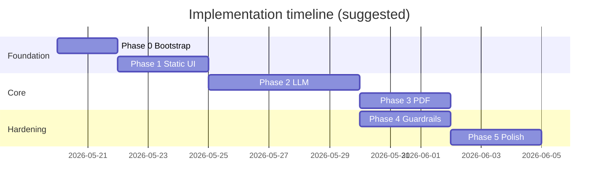

# Resume Shapeshifter — Phase-Wise Implementation Plan

This plan operationalizes [architecture.md](./architecture.md) into five build phases. Each phase has objectives, tasks, deliverables, exit criteria, and dependencies. Work top-to-bottom within a phase; do not start a phase until its **prerequisites** are met.

**Guiding principle:** ship a working vertical slice early (paste text → see diff → export PDF), then deepen correctness and polish.

---

## Overview

| Phase | Name | Primary outcome | Depends on |
|-------|------|-----------------|------------|
| **0** | Project bootstrap | Runnable Next.js app, schemas, fixtures | — |
| **1** | Static prototype | Full UI flow with mock data | Phase 0 |
| **2** | LLM integration | Real parse, score, gap, tailor via API | Phase 1 |
| **3** | PDF export | Tailored + comparison PDF download | Phase 2 |
| **4** | Guardrails & validation | Truthfulness checks, export gates | Phase 2 (can overlap Phase 3) |
| **5** | Polish & demo readiness | Portfolio-quality UX and demo script | Phases 3–4 |



Phases 3 and 4 can run **in parallel** after Phase 2 if two contributors are available.

---

## Phase 0 — Project Bootstrap

### Objective

Establish the repository skeleton, shared types, tooling, and sample data so later phases plug into a consistent structure.

### Tasks

| # | Task | Owner hint | Output |
|---|------|------------|--------|
| 0.1 | Initialize Next.js 14+ (App Router), TypeScript, Tailwind, ESLint | Dev | `package.json`, `tsconfig.json` |
| 0.2 | Add Shadcn UI (Button, Card, Textarea, Dialog, Skeleton, Badge) | Dev | `components/ui/*` |
| 0.3 | Create `.env.example` with `GROQ_API_KEY`, `GROQ_MODEL`, limits | Dev | `.env.example` |
| 0.4 | Implement `lib/schemas.ts` — all Zod schemas from architecture §6 | Dev | Types exported for entire app |
| 0.5 | Add `lib/fixtures/` — sample `ResumeProfile`, `JobDescriptionProfile`, `TailoringRun` | Dev | `sample-run.json` |
| 0.6 | Add Vitest; one schema validation test per major type | Dev | `lib/schemas.test.ts` |
| 0.7 | Create `README.md` with local setup (`pnpm install`, `pnpm dev`) | Dev | Runnable clone instructions |
| 0.8 | Create folder layout per architecture Appendix A (empty stubs OK) | Dev | `app/`, `lib/`, `prompts/`, `components/` |

### Deliverables

- App runs at `http://localhost:3000` with placeholder landing page.
- `ResumeProfile`, `JobDescriptionProfile`, `MatchScore`, `TailoredResume`, `GapAnalysis`, `TailoringRun` schemas parse fixture JSON.
- Sample data committed under `public/samples/` or `lib/fixtures/`.

### Exit criteria

- [ ] `pnpm dev` starts without errors.
- [ ] `pnpm test` passes schema tests.
- [ ] Importing types from `lib/schemas.ts` works in a stub API route.

### Estimated effort

**0.5–1 day**

---

## Phase 1 — Static Prototype

### Objective

Build the complete user journey using **mocked** `TailoringRun` data. No LLM calls. Validates UX, component contracts, and state flow before API cost/complexity.

### Prerequisites

Phase 0 complete.

### Tasks

#### 1.1 Layout and navigation

| # | Task | Files |
|---|------|-------|
| 1.1.1 | Landing page with product one-liner and CTA | `app/page.tsx` |
| 1.1.2 | Tailor workspace (single page MVP: input → analysis → review → export sections) | `app/tailor/page.tsx` |
| 1.1.3 | App shell: header, footer, disclaimer snippet | `app/layout.tsx`, `components/DisclaimerBanner.tsx` |

#### 1.2 Input components (paste-only for Phase 1)

| # | Task | Files |
|---|------|-------|
| 1.2.1 | Resume textarea with character count | `components/ResumeInput.tsx` |
| 1.2.2 | JD textarea | `components/JDInput.tsx` |
| 1.2.3 | "Load sample" buttons wired to fixtures | Same + `lib/fixtures/*` |
| 1.2.4 | Stub file upload UI (disabled or "coming soon") | `ResumeInput.tsx` |

#### 1.3 Mock pipeline

| # | Task | Files |
|---|------|-------|
| 1.3.1 | `lib/mock-orchestrator.ts` — returns fixture `TailoringRun` after fake delay | `lib/mock-orchestrator.ts` |
| 1.3.2 | Client hook or reducer: `useTailoringRun` with `sessionStorage` persistence | `lib/hooks/useTailoringRun.ts` |
| 1.3.3 | "Analyze" → sets status `analyzed`, shows mock score/gaps | `app/tailor/page.tsx` |
| 1.3.4 | "Generate tailored resume" → sets status `tailored`, loads mock bullets | Same |

#### 1.4 Results UI

| # | Task | Files |
|---|------|-------|
| 1.4.1 | JD summary panel (title, company, skills, responsibilities) | `components/JDSummary.tsx` |
| 1.4.2 | `ScoreCard` — original score only in analyze step; both scores after tailor | `components/ScoreCard.tsx` |
| 1.4.3 | `GapAnalysis` list with importance badges | `components/GapAnalysis.tsx` |
| 1.4.4 | `SideBySideDiff` — two columns, highlight changed bullets | `components/SideBySideDiff.tsx` |
| 1.4.5 | `BulletChangeCard` — reason, keywords, confidence, risk (from fixture) | `components/BulletChangeCard.tsx` |
| 1.4.6 | Export section placeholder ("PDF in Phase 3") | `components/PDFExportButton.tsx` (disabled) |

#### 1.5 UX basics

| # | Task |
|---|------|
| 1.5.1 | Loading spinner/skeleton during mock delay (300–800 ms) |
| 1.5.2 | Disable buttons when inputs empty |
| 1.5.3 | Basic responsive layout (stack columns on mobile) |

### Deliverables

- End-to-end **click-through demo** with sample data: paste → Analyze → Tailor → Review side-by-side.
- No backend beyond optional static JSON import.

### Exit criteria

- [ ] User can load samples and walk full flow without API key.
- [ ] `TailoringRun` persists across page refresh via `sessionStorage`.
- [ ] All Phase 1 components accept types from `lib/schemas.ts` (no `any`).
- [ ] Side-by-side view shows at least 3 bullets with metadata from fixture.

### Out of scope (defer)

- Real parsing, LLM, PDF, file upload, guardrails.

### Estimated effort

**2–3 days**

---

## Phase 2 — LLM Integration

### Objective

Replace mocks with real server-side parsing, scoring, gap analysis, and tailoring. API keys stay on server; all LLM outputs validated with Zod.

### Prerequisites

Phase 1 complete (UI contracts stable).

### Tasks

#### 2.1 LLM infrastructure

| # | Task | Files |
|---|------|-------|
| 2.1.1 | `lib/llm.ts` — Groq client, JSON mode, timeout, token logging | `lib/llm.ts` |
| 2.1.2 | `callLlmJson<T>(prompt, schema)` — parse + Zod + **one retry** on failure | `lib/llm.ts` |
| 2.1.3 | Input truncation utility (`MAX_RESUME_CHARS`, `MAX_JD_CHARS`) | `lib/truncate.ts` |

#### 2.2 Prompts (one file per task)

| # | Task | Files |
|---|------|-------|
| 2.2.1 | JD extraction prompt + system rules | `prompts/jd-extraction.ts` |
| 2.2.2 | Resume parser cleanup prompt | `prompts/resume-parser.ts` |
| 2.2.3 | Match scoring prompt | `prompts/match-scoring.ts` |
| 2.2.4 | Bullet rewriter prompt (truthfulness rules) | `prompts/bullet-rewriter.ts` |
| 2.2.5 | Gap analysis prompt | `prompts/gap-analysis.ts` |
| 2.2.6 | (Optional) Final assembly prompt | `prompts/final-assembly.ts` |

#### 2.3 Domain services

| # | Task | Files |
|---|------|-------|
| 2.3.1 | `jd-parser.ts` — LLM extract + normalize skills/tools | `lib/jd-parser.ts` |
| 2.3.2 | `resume-parser.ts` — text in → heuristics → LLM → `ResumeProfile` | `lib/resume-parser.ts` |
| 2.3.3 | `match-engine.ts` — deterministic skill overlap + LLM explanation; reconcile scores | `lib/match-engine.ts` |
| 2.3.4 | `gap-engine.ts` — deterministic missing required + LLM weak/medium gaps | `lib/gap-engine.ts` |
| 2.3.5 | `tailoring-engine.ts` — bullet rewrite loop, summary/skills optional pass | `lib/tailoring-engine.ts` |
| 2.3.6 | `orchestrator.ts` — `parseRun`, `analyzeRun`, `tailorRun` | `lib/orchestrator.ts` |

#### 2.4 API routes

| # | Task | Files |
|---|------|-------|
| 2.4.1 | `POST /api/parse` — resume text + JD text → profiles | `app/api/parse/route.ts` |
| 2.4.2 | `POST /api/analyze` — profiles → `originalMatch`, `gapAnalysis`, `runId` | `app/api/analyze/route.ts` |
| 2.4.3 | `POST /api/tailor` — profiles + gaps → `tailoredResume`, `tailoredMatch` | `app/api/tailor/route.ts` |
| 2.4.4 | Standard error contract (`PARSE_FAILED`, `LLM_INVALID_JSON`, etc.) | Shared `lib/api-error.ts` |

#### 2.5 Wire UI to API

| # | Task |
|---|------|
| 2.5.1 | Replace `mock-orchestrator` calls with `fetch('/api/...')` |
| 2.5.2 | Step 1: Parse on "Analyze" (or separate parse step if UX prefers) |
| 2.5.3 | Step 2: Analyze → show JD summary, score, gaps |
| 2.5.4 | Step 3: Tailor → show side-by-side + both scores |
| 2.5.5 | Error toasts + retry for LLM/parse failures |

#### 2.6 Tests

| # | Task | Files |
|---|------|-------|
| 2.6.1 | Unit tests: skill overlap scoring (no LLM) | `lib/match-engine.test.ts` |
| 2.6.2 | Orchestrator test with mocked `lib/llm.ts` | `lib/orchestrator.test.ts` |
| 2.6.3 | Manual test script: paste real resume + real JD, inspect JSON in logs | `docs/manual-test-phase2.md` (optional) |

### Deliverables

- Working analyze + tailor flow with real LLM output.
- `TailoringRun` populated from server responses and stored client-side.

### Exit criteria

- [ ] Paste resume + JD → Analyze returns structured JD, numeric score, ≥1 gap.
- [ ] Tailor returns rewritten bullets with `original`, `tailored`, `changeReason`, `confidence`.
- [ ] Tailored match score ≥ original score for sample demo case (not required for all inputs, but demo path should improve).
- [ ] Invalid LLM JSON triggers retry then user-visible error.
- [ ] No `GROQ_API_KEY` exposed to client bundle.
- [ ] Unit tests pass for match-engine and orchestrator (mocked).

### Vertical slice option (fast path)

If behind schedule, implement **`POST /api/tailor`** only that runs full pipeline internally (parse → analyze → tailor in one request), then split routes later.

### Out of scope (defer)

- PDF/DOCX upload parsing (text paste only unless quick win).
- Guardrails beyond prompt instructions.
- PDF export.

### Estimated effort

**4–6 days**

---

## Phase 3 — PDF Export

### Objective

Generate the **proof artifact**: side-by-side comparison PDF and clean tailored resume PDF, server-side only.

### Prerequisites

Phase 2 complete — real `TailoringRun` available.

### Tasks

#### 3.1 PDF stack decision

| Option | When to choose |
|--------|----------------|
| **Playwright / Puppeteer** | Need precise HTML/CSS two-column layout and highlights |
| **@react-pdf/renderer** | Serverless-friendly; accept simpler layout |

Document choice in `README.md`.

#### 3.2 Templates

| # | Task | Files |
|---|------|-------|
| 3.2.1 | Print CSS — ATS fonts, page breaks, two-column grid | `lib/pdf/styles.ts` |
| 3.2.2 | Tailored resume template (single column, no diff) | `lib/pdf/templates/tailored.tsx` |
| 3.2.3 | Comparison template — header scores, JD summary, columns, gap table, disclaimer footer | `lib/pdf/templates/comparison.tsx` |
| 3.2.4 | Highlight changed bullets (background or border-left) | Comparison template |

#### 3.3 PDF service

| # | Task | Files |
|---|------|-------|
| 3.3.1 | `lib/pdf/render.ts` — HTML/React → PDF buffer | `lib/pdf/render.ts` |
| 3.3.2 | `lib/pdf-generator.ts` — `generateTailoredPdf(run)`, `generateComparisonPdf(run)` | `lib/pdf-generator.ts` |
| 3.3.3 | `POST /api/export` — body: `{ runId, format }`; return PDF stream or base64 | `app/api/export/route.ts` |

#### 3.4 UI integration

| # | Task | Files |
|---|------|-------|
| 3.4.1 | Enable `PDFExportButton` — download tailored, comparison, or both | `components/PDFExportButton.tsx` |
| 3.4.2 | Pass full `TailoringRun` in export request (or server-side cache by `runId` if added) | API + client |
| 3.4.3 | Loading state during PDF generation (may take 5–15 s) | UI |

#### 3.5 Tests

| # | Task |
|---|------|
| 3.5.1 | Integration test: fixture `TailoringRun` → export returns non-empty PDF buffer |
| 3.5.2 | Manual: open PDF, verify scores, columns, disclaimer, gap table |

### Deliverables

- Downloadable **comparison PDF** and **tailored resume PDF** matching architecture §12.

### Exit criteria

- [ ] Comparison PDF includes: job title/company, before/after scores, side-by-side bullets, gap summary, disclaimer on every page.
- [ ] Tailored PDF is submission-ready (no diff highlights).
- [ ] Export works from UI after tailor step completes.
- [ ] PDF generation runs only on server; file downloads in browser.

### Out of scope (defer)

- DOCX/Markdown export.
- User confirmation gate before export (Phase 4).

### Estimated effort

**2–4 days** (add buffer if Playwright on Vercel)

---

## Phase 4 — Guardrails & Validation

### Objective

Reduce fabrication risk via post-LLM checks, risk flags, and user acknowledgment before export. Strengthen JSON and schema discipline.

### Prerequisites

Phase 2 complete (tailoring engine exists). Can proceed in parallel with Phase 3.

### Tasks

#### 4.1 Guardrails module

| # | Task | Files |
|---|------|-------|
| 4.1.1 | `lib/guardrails.ts` — `validateBullet(original, tailored, resumeProfile)` | `lib/guardrails.ts` |
| 4.1.2 | Detect new metrics not in original bullet | guardrails |
| 4.1.3 | Detect new tools/skills not in resume profile | guardrails |
| 4.1.4 | Detect employer/degree/cert not in source | guardrails |
| 4.1.5 | Keyword density spike heuristic | guardrails |
| 4.1.6 | Map failures → `riskFlag`, lower `confidence` | guardrails |

#### 4.2 Pipeline integration

| # | Task |
|---|------|
| 4.2.1 | Run guardrails in `tailoring-engine` after each bullet rewrite |
| 4.2.2 | Optionally block export if `GUARDRAIL_BLOCKED` severity (config flag) |
| 4.2.3 | Surface risk badges in `BulletChangeCard` and `SideBySideDiff` |

#### 4.3 User confirmation

| # | Task | Files |
|---|------|-------|
| 4.3.1 | Checkbox per high-risk bullet: `userConfirmed` | `BulletChangeCard.tsx` |
| 4.3.2 | Disclaimer modal before export; must accept to download | `PDFExportButton.tsx` |
| 4.3.3 | Disable export until disclaimer accepted AND all high-risk bullets confirmed or edited | Export flow |

#### 4.4 Schema hardening

| # | Task |
|---|------|
| 4.4.1 | Stricter Zod (min/max lengths, enum enforcement) |
| 4.4.2 | Reject orchestrator output that fails schema before returning to client |
| 4.4.3 | Log prompt version id per `runId` (no full resume in logs) |

#### 4.5 Tests

| # | Task | Files |
|---|------|-------|
| 4.5.1 | Guardrails unit tests with adversarial bullets | `lib/guardrails.test.ts` |
| 4.5.2 | Test: invented "50% revenue increase" → `unsupported_metric` | Same |

### Deliverables

- Documented risk flags in UI; export gated on user review.

### Exit criteria

- [ ] Injecting a fake metric in a tailored bullet flags `riskFlag` (test proves it).
- [ ] New tool in bullet not in resume flags risk or is stripped.
- [ ] Export requires disclaimer acknowledgment.
- [ ] High-risk bullets require confirmation or edit before export.

### Estimated effort

**2–3 days**

---

## Phase 5 — Polish & Demo Readiness

### Objective

Production-quality portfolio demo: file upload, loading/error states, samples, README demo script, deployment.

### Prerequisites

Phases 2–4 substantially complete (PDF + guardrails).

### Tasks

#### 5.1 Document ingestion

| # | Task | Files |
|---|------|-------|
| 5.1.1 | PDF upload — `pdf-parse`, extract text, preview before parse | `ResumeInput.tsx`, `lib/resume-parser.ts` |
| 5.1.2 | DOCX upload — `mammoth` | Same |
| 5.1.3 | Parse failure → prompt paste fallback with extracted preview | UI |
| 5.1.4 | File size/MIME validation (5 MB cap) | API route |

#### 5.2 UX polish

| # | Task |
|---|------|
| 5.2.1 | Skeleton loaders per stage: parse, analyze, tailor, export |
| 5.2.2 | Empty states and inline validation messages |
| 5.2.3 | Split routes optional: `/tailor/analyze`, `/tailor/review`, `/tailor/export` |
| 5.2.4 | Score subscores breakdown in `ScoreCard` (skill, keyword, seniority, etc.) |
| 5.2.5 | Mobile-friendly side-by-side (tabs on small screens) |

#### 5.3 Sample content

| # | Task | Files |
|---|------|-------|
| 5.3.1 | `public/samples/sample-resume.txt` | Public |
| 5.3.2 | `public/samples/sample-jd.txt` (real job listing text) | Public |
| 5.3.3 | One-click load samples on landing and tailor page | UI |

#### 5.4 Demo & docs

| # | Task | Files |
|---|------|-------|
| 5.4.1 | `docs/DEMO.md` — step-by-step demo script with expected scores | Docs |
| 5.4.2 | README: features, env setup, architecture link, screenshot/GIF | `README.md` |
| 5.4.3 | Record golden path: sample → analyze → tailor → comparison PDF | Demo artifact |

#### 5.5 Deployment

| # | Task |
|---|------|
| 5.5.1 | Deploy to Vercel; env vars configured |
| 5.5.2 | Resolve PDF renderer for serverless (Chromium bundle or React-PDF) |
| 5.5.3 | Basic rate limit on `/api/*` (middleware) |
| 5.5.4 | E2E test (Playwright): sample → tailor → PDF download exists |

#### 5.6 Optional enhancements (time permitting)

- `POST /api/tailor` streaming progress via SSE.
- SQLite/Supabase persistence for `tailoring_runs`.
- Split analyze/tailor into separate pages with progress stepper.

### Deliverables

- Deployed URL, demo script, sample files, README suitable for portfolio.

### Exit criteria (maps to architecture §18)

- [ ] All domain types in `lib/schemas.ts` used end-to-end.
- [ ] Orchestrator: parse → analyze → tailor → export without manual steps.
- [ ] Six prompt modules under `prompts/`.
- [ ] Comparison PDF: scores, JD summary, highlights, gaps, disclaimer.
- [ ] Guardrails flag metric/tool injection (tests pass).
- [ ] **Real job listing** demo produces proof PDF showing improved match without fabrication.

### Estimated effort

**2–4 days**

---

## Cross-Phase Checklist (Definition of Done)

Use this as the final gate before calling the project complete:

| # | Requirement | Phase |
|---|-------------|-------|
| 1 | Paste resume and JD | 1–2 |
| 2 | Click Analyze → original match score + JD requirements | 2 |
| 3 | See gaps (missing/weak requirements) | 2 |
| 4 | Generate tailored resume | 2 |
| 5 | Side-by-side bullet review with explanations | 1–2 |
| 6 | Tailored match score > original (demo path) | 2 |
| 7 | Export side-by-side comparison PDF | 3 |
| 8 | Truthfulness disclaimer on export | 4–5 |
| 9 | Risk flags on questionable bullets | 4 |
| 10 | Sample data + demo script for portfolio | 5 |

---

## Suggested Work Order (Single Developer)

```text
Day 1–2:   Phase 0 + Phase 1 (bootstrap + full mock UI)
Day 3–5:   Phase 2 (LLM + API + wire UI) — prioritize text paste only
Day 6–7:   Phase 3 (comparison PDF first, then tailored PDF)
Day 8:     Phase 4 (guardrails + export gate)
Day 9–10:  Phase 5 (uploads, polish, deploy, demo script)
```

**Early demo milestone (end of Day 5):** Phase 2 vertical slice with browser-only review (no PDF yet).

**Portfolio milestone (end of Day 7):** Phase 3 comparison PDF from real tailoring run.

---

## Risk Triggers & Phase Adjustments

| Symptom | Adjustment |
|---------|------------|
| LLM JSON frequently invalid | Stay on Phase 2; add repair prompt; reduce bullet batch size |
| PDF fails on Vercel | Switch to `@react-pdf/renderer` in Phase 3; simplify layout |
| Parses garble PDF | Defer 5.1; strengthen paste-only path in demo script |
| Tailoring invents experience | Pause Phase 5; deepen Phase 4 guardrails and prompt rules |
| Slow API costs | Cache JD parse per session; rewrite fewer bullets (top 5 by relevance) |

---

## File Creation Order (Quick Reference)

```text
Phase 0:  lib/schemas.ts → lib/fixtures/* → app/layout.tsx → app/page.tsx
Phase 1:  components/*Input*, ScoreCard, GapAnalysis, SideBySideDiff → app/tailor/page.tsx
Phase 2:  lib/llm.ts → prompts/* → lib/*-parser, *-engine → lib/orchestrator.ts → app/api/*
Phase 3:  lib/pdf/* → lib/pdf-generator.ts → app/api/export/route.ts
Phase 4:  lib/guardrails.ts → wire tailoring-engine → export modal
Phase 5:  file upload → public/samples → docs/DEMO.md → deploy
```

---

## Related Documents

- [problemStatement.md](./problemStatement.md) — product requirements and acceptance criteria
- [architecture.md](./architecture.md) — system design, APIs, and service boundaries
- [edge-cases/](./edge-cases/README.md) — per-phase edge case reference (use while coding each phase)

---

*Implementation plan version 1.0 — aligned with architecture.md Phase 16 (§16 Implementation Phases).*
